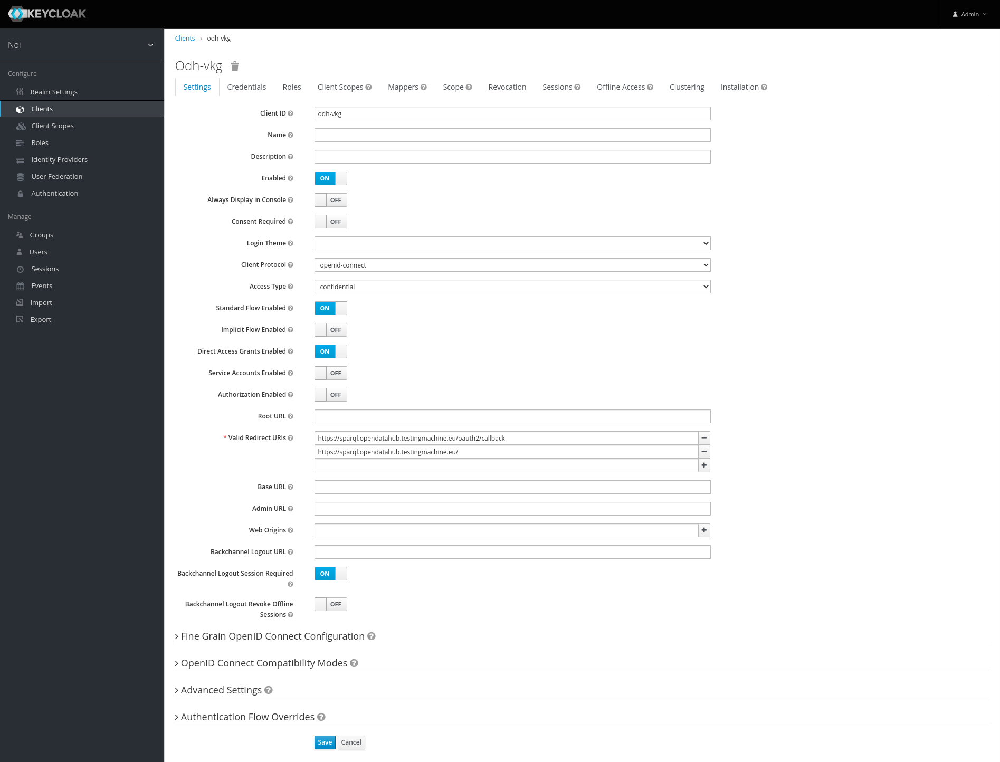
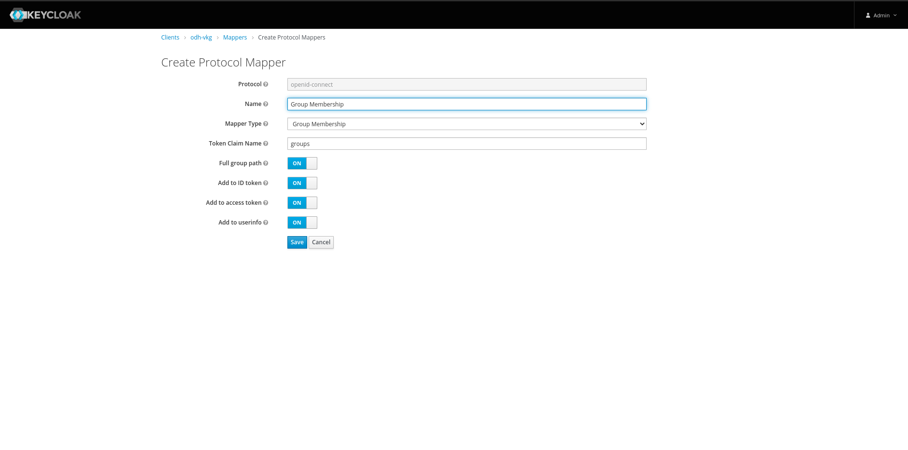

# Authentication

`odh-vkg` authenticates users trying to access the `/restricted` path via a
local authentication proxy, which is configured to connect to a Keycloak
instance. Access is granted via membership of specified groups. The
configuration is a two step process: first, we configure the Keycloak instance
by creating a client application, then we configure the access policies on the
authentication proxy.

Table of contents

- [Authentication](#authentication)
	- [Keycloak configuration](#keycloak-configuration)
	- [Authentication proxy configuration](#authentication-proxy-configuration)

## Keycloak configuration

In your realm of choice, create a new client with **Access Type**
`confidential`. Add `https://<odh-vkg endpoint>` and `https://<odh-vkg
endpoint>/oauth2/callback` as **Valid Redirect URIs**. If you get an error
during logout saying that the redirect_uri is invalid, try to remove the final
`/` from each URI. Take note of the **Secret** in the Credentials tab of the client.

Next, navigate to the Mappers tab of the client and create a new mapper with
**Mapper Type** `Group Membership` and **Token Claim Name** `groups`.

Last, decide which groups will have access to the `/restricted` endpoint and
note their name down. Only users which are members of at least one of these
groups will be granted access.

| :exclamation: Email address is required                                                                                                                                                                             |
| :------------------------------------------------------------------------------------------------------------------------------------------------------------------------------------------------------------------ |
| Internally, the proxy authenticates users via their email address, so if the user doesn't have an associated email address the proxy will panic and return `500`. This is a core logic which can't be reconfigured. |

| :grey_question: How to configure session idle timeout in Keycloak 12 timeout                                                                                                                                                                                                                                                                                                                                                                                                                                                                                       |
| :----------------------------------------------------------------------------------------------------------------------------------------------------------------------------------------------------------------------------------------------------------------------------------------------------------------------------------------------------------------------------------------------------------------------------------------------------------------------------------------------------------------------------------------------------------------- |
| The session idle timeout is configured per realm and it's global for every client in the realm. Therefore changing the session idle timeout will change it for every client in the realm. To change it, navigate to the `Tokens` tab of the `Realm Settings` page and change the `SSO Session Idle` parameter. The `Access Token Lifespan` field must be shorter than the new idle timeout. Notice that Keycloak keeps a grace period of two minutes before expiring a token, therefore the session will actually be expired after `SSO Session Idle` + 2 minutes. |

## Authentication proxy configuration

The authentication proxy is local to the `odh-vkg` deployment and is therefore configured via environment variables provided by the deployment stack. There are five environment variables, four of which are Keycloak-specific, while the last one is used for securing authentication sessions. All of these variables must be configured correctly for the proxy to function.

| Env variable               | Description                                                                                                                                                                                                                                  |
| -------------------------- | -------------------------------------------------------------------------------------------------------------------------------------------------------------------------------------------------------------------------------------------- |
| `KEYCLOAK_REALM_URL`       | URL of the Keycloak realm. In default installations of Keycloak is `https://<keycloak endpoint>/auth/realms/<realm>`.                                                                                                                         |
| `KEYCLOAK_DOMAIN_NAME`     | Domain name of the Keycloak server. Equivalent to `<keycloak endpoint>` above.                                                                                                                                                               |
| `KEYCLOAK_CLIENT_ID`       | ID of the client created during Keycloak configuration.                                                                                                                                                                                      |
| `KEYCLOAK_CLIENT_SECRET`   | The **Secret** in the Credential tab of the client.                                                                                                                                                                                          |
| `KEYCLOAK_ALLOWED_GROUPS`  | List of comma-separated Keycloak groups which should have access to the `/restricted` endpoint. Keycloak groups are implemented as a tree, so you must specify their full path here instead of only their names. Example: `/VKG Full Access` |
| `AUTH_PROXY_COOKIE_SECRET` | Key which is used by the proxy to secure cookies. Must be 16, 32 or 64 strong random bytes, optionally base64 encoded. Changing this value will invalidate all sessions, requiring re-authentication.                                        |
