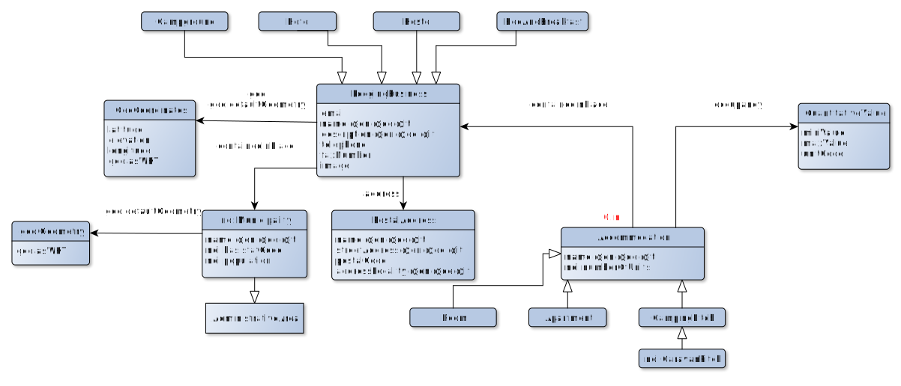
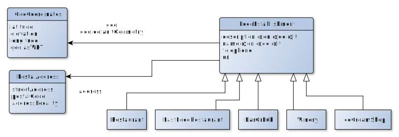

# Schema of the ODH VKG

The Open Data Hub Virtual Knowledge Graph is available as a SPARQL endpoint.
Here we describe its schema (its structure).

## How to read the diagrams

### Default prefix
By default, classes and properties use `http://schema.org/` as prefix.

::: tip Tip
You can dereference the URLs of classes and properties to see their official documentation. For instance, have a look at [http://schema.org/Hotel](http://schema.org/Hotel).
:::

### Arrows

Black arrows are for object properties. White arrows denotes a sub-class relationship.

### Cardinalities
Cardinalities are provided by data and object properties. Cardinalities of 1 are kept most of the time implicit, expect for highlighting something counter-intuitive.

Cardinalities of object properties follow the ["look across" notation](https://www.quora.com/How-do-we-read-cardinality-in-a-UML-diagram-or-in-E-A-diagram) like in UML diagrams. 

For instance, in the accommodation diagram, for each `Accommodation` instance, there is exactly one `LodgingBusiness` instance accessible through the object property `schema:containedInPlace`. On the opposite direction, for each `LodgingBusiness` instance there are 0 or n instances of `Accommodation` that points to it through the object property `schema:containedInPlace`.

::: warning Warning
If the cardinalities are 1 for all the data properties ("attributes"), be ready to sometimes get some empty strings and other incorrect default values (e.g. an altitude of 0 m in South-Tyrol). 

These data quality issues are not cleaned at the VKG level on purpose so as to be able to illustrate and report them. Instead they should be cleaned directly at the data source level.
:::

## Accommodation

## Food establishments

## Events
